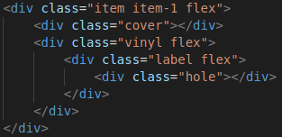
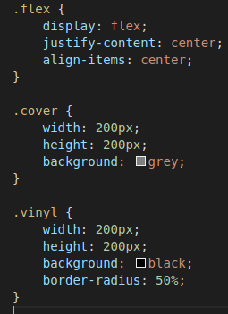

## dsi-p2-jspotify-alu0100658705

## Pablo Bethencourt Díaz

## alu0100658705@ull.edu.es

# Práctica 2: Javascript ES2015+

### El objetivo de la práctica es crear una página JavaSpotify con varios vinilos que reproduzcan una canción cuando pulses sobre ellos.

1. Crea un proyecto con Parcel para trabajar con los siguientes fragmentos de código:

Amplíalo lo que consideres necesario para adaptarlo a tu gusto. Se tomará en cuenta este esfuerzo a la hora de evaluar.

Veamos la estructura de directorios del proyecto:

2. Busca varias canciones en formato MP3 y guárdalas en la carpeta assets. Haz lo mismo con varias imágenes para las carátulas de los vinilos. La forma más sencilla de hacer esto es metiendo un  dentro de la clase cover, aunque también puedes hacerlo desde CSS con la propiedad background-image. Vigila las proporciones de las imágenes para que sean cuadradas.

3. En la previsualización tienes el ejemplo mínimo a realizar, pero puedes ir investigando y añadiendo características para hacerlo más visual u organizar el contenido. Esto te permitirá adelantarte a temas que veremos un poco más adelante.

4. Recuerda ampliar el código HTML. Debes tener el mismo número de items en el HTML, que de imágenes de carátula y audios. Además, sería interesante incluir los siguientes estilos CSS:

### Retos

1. Revisa la API de audio y añade otras funcionalidades no mencionadas en la práctica. Puedes utilizar funcionalidades como la tasa de velocidad, volumen o eventos especiales para añadir funcionalidades concretas. No te olvides de documentarlas en el README.md y mencionarlo como Funcionalidades extra.

2. La librería Howler.js es una interesante librería que nos hace mucho más fácil trabajar con archivos de audio. ¿Serías capaz de cambiar tu proyecto y utilizar la librería Howler.js? ¿Cuál prefieres utilizar? ¿Por qué?

3. ¿Serías capaz de realizar esta práctica íntegramente desde Javascript? Es decir, crear la estructura HTML del interior del <body> directamente desde Javascript, haciendo uso de document.body y la creación de elementos en el DOM. Esto ayuda a comprender como funciona a bajo nivel el DOM de una página HTML y son unas bases interesantes si en el futuro quieres aprender como funcionan por debajo librerías como React y conceptos utilizados como Virtual DOM.
