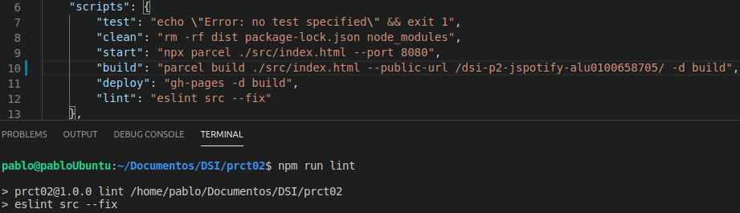

## dsi-p2-jspotify-alu0100658705

## Pablo Bethencourt Díaz

## alu0100658705@ull.edu.es

# Práctica 2: Javascript ES2015+

### El objetivo de la práctica es crear una página JavaSpotify con varios vinilos que reproduzcan una canción cuando pulses sobre ellos.

- **Crea un proyecto con Parcel para trabajar con los siguientes fragmentos de código:**

  

  

  Se han añadido nuevas clases para representar un total de 3 vinilos.

  Veamos la estructura de directorios del proyecto:

  

- **Utilizando módulos de Javascript, crea dos clases Player y Song y expórtalas para utilizar en nuestro index.js.**

  Vemos el contenido del fichero _index.js_ donde se crea un objeto map a partir del hash _audios_ y se importa la clase _Player_ para luego instanciarla:

  

- **La clase Player.js debe analizar los ítems del map (representan la clase HTML y el nombre del MP3 asociado) uno por uno e instanciar una canción ( Song ).**

  Se ha definido esta clase de la siguiente forma: en primer lugar recibe el objeto **map** desde _index.js_, donde se recorre y se le pasa a cada nuevo objeto _Song_ la clave, que corresponde al item desde donde se activará el evento _onclick_, la canción que se debe reproducir y el elemento que hace referencia al vinilo que ha de desplazarse cuando se produzca el evento, luego posteiormente se invoca al método _reproducir_ del fichero _Song.js_ que se encarga de reproducir o pausar la canción. Veamos su implementación:

  

- **La clase Song.js debe buscar en el DOM el elemento HTML indicado (la clave del map) y aplicarle un listener para reproducir la canción si se pulsa encima.**

  Para la clase _Song.js_ se ha llevado a cabo la siguiente implementación:

  

  Luego se ha desarrolado una función _reproducir_ a la que se le va a pasar cada canción desde la clase _Player_, que inicia o pausa la canción cuando se activa el evento _onclick_.

- **Asegúrate de estar utilizando Prettier (recomendado) y ESLint para revisar la calidad de tu código y corregir todos los errores. Añade un script lint en los scripts de NPM que revise el código y/o utiliza la extensión adecuada para verlo desde VSCode.**

  Vemos la versión de _Prettier_ y de _ESLint_ instalada y el script lint (junto a todos los demás):

  

  

### Retos

1. **Revisa la API de audio y añade otras funcionalidades no mencionadas en la práctica.**

Funcionalidades extra:

Dentro del html se han creado 3 nuevas clases (una para cada vinilo), donde se han añadido botones que realizan las siguientes acciones:

- Cambio en el volumen:

Se creó una nueva función que controla el volumen para cada una de las pistas en caso de estar sonando, se definen dos nuevos atributos para controlar por un lado cuando se subre el volumen y por otro para cuando se baja:

- Reiniciar el audio:

Una vez está sonando la pista, se define una nueva acción que reinicia el audio, esta nueva utilidad se ha añadido a la función "reproducir" mencionada anteriormente, vemos su implementación:

2. **La librería Howler.js es una interesante librería que nos hace mucho más fácil trabajar con archivos de audio.**

La implementación realizada con Howler es muy similar a la anterior, solo se han añadido una serie de atributos y se ha suprimido la clase _Player.js_, además de limitar las funcionalidades. Veamos los dos ficheros implementados (indexhowler.js y Songhowler.js):

**¿Cuál prefieres utilizar? ¿Por qué?**

En principio el funcionamiento de ambas me ha resultado similar, y como tampoco he indagado en exceso con las posibilidades de Howler, no tengo una preferencia clara por ninguna de las dos librerías. Aunque destaco que para el caso de Howler, el poder poner atributos cuando se instancia el objeto (por ejemplo que la canción se reproduzca en bucle o que se inicie automaticamente) es un punto muy favorable.
